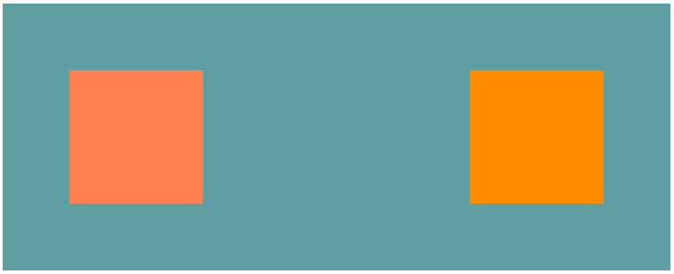

# 1. BFC
  * ## 定义：
    **BFC(Block formatting context)** 直译为"块级格式化上下文"。它是一个独立的渲染区域，只有Block-level box参与， 它规定了内部的Block-level Box如何布局，并且与这个区域外部毫不相干。创建了块格式化上下文的元素中的所有内容都会被包含到该BFC中。

  * ## 布局规则：
    - 内部的Box会在垂直方向，一个接一个地放置。
    - Box垂直方向的距离由margin决定。属于同一个BFC的两个相邻Box的margin会发生重叠。
    - 每个元素的margin box的左边， 与包含块border box的左边相接触(对于从左往右的格式化，否则相反)。即使存在浮动也是如此。
    - BFC的区域不会与float box重叠。
    - BFC就是页面上的一个隔离的独立容器，容器里面的子元素不会影响到外面的元素。反之也如此。
    - 计算BFC的高度时，浮动元素也参与计算

  * ## BFC的生成：
    - 根元素或包含根元素的元素
    - 浮动元素（元素的 float 不是 none）
    - 绝对定位元素（元素的 position 为 absolute 或 fixed）
    - 行内块元素（元素的 display 为 inline-block）
    - 表格单元格（元素的 display为 table-cell，HTML表格单元格默认为该值）
    - 表格标题（元素的 display 为 table-caption，HTML表格标题默认为该值）
    - 匿名表格单元格元素（元素的 display为 table、table-row、 table-row-group、table-header-group、table-footer-group（分别是HTML table、row、tbody、thead、tfoot的默认属性）或 inline-table）
    - overflow 值不为 visible 的块元素
    - display 值为 flow-root 的元素
    - contain 值为 layout、content或 strict 的元素
    - 弹性元素（display为 flex 或 inline-flex元素的直接子元素）
    - 网格元素（display为 grid 或 inline-grid 元素的直接子元素）
    - 多列容器（元素的 column-count 或 column-width 不为 auto，包括 column-count 为 1）
    - column-span 为 all 的元素始终会创建一个新的BFC，即使该元素没有包裹在一个多列容器中（标准变更，Chrome bug）。

  * ## BFC的应用：
    ### 1. 防止垂直 margin 重叠
      * #### 示例：
        ```html
        <!DOCTYPE html>
        <html lang="en">
          <head>
            <meta charset="UTF-8">
            <title>BFC</title>
            <style>
              p {
                margin: 50px;
                width: 100px;
                height: 50px;
                text-align: center;
                background-color: skyblue;
              }
              div {
                overflow: hidden;    //触发BFC
              }
            </style>
          </head>
          <body>
            <p>top</div>
            <div class="bfc">
              <p>bottom</div>
            </div>
          </body>
        </html>
        ```
      * #### 页面效果：
        

    ### 2. 清除内部浮动
      * #### 示例：
        ```javascript
        <!DOCTYPE html>
        <html lang="en">
          <head>
            <meta charset="UTF-8">
            <title>BFC</title>
            <style>
              .container {
                width: 500px;
                background-color: cadetblue;
                overflow: hidden;    //触发BFC
              }
              .left {
                width: 100px;
                height: 100px;
                margin: 50px;
                background-color: coral;
                float: left;
              }
              .right {
                width: 100px;
                height: 100px;
                margin: 50px;
                background-color: darkorange;
                float: right;
              }
            </style>
          </head>
          <body>
            <div class="container">
              <div class="left"></div>
              <div class="right"></div>
            </div>
          </body>
        </html>
        ```
      * #### 页面效果：
        

    ### 3. 解决侵占浮动元素的问题：
      * #### 示例：
        ```javascript
        <!DOCTYPE html>
        <html lang="en">
          <head>
            <meta charset="UTF-8">
            <title>BFC</title>
            <style>
              .aside {
                width: 100px;
                height: 100px;
                background-color: coral;
                float: left;
              }
              .main {
                width: 300px;
                height: 200px;
                background-color: darkblue;
                overflow: hidden;    //触发BFC
              }
            </style>
          </head>
          <body>
            <div class="aside"></div>
            <div class="main"></div>
          </body>
        </html>
        ```
      
      * #### 页面效果：
        

  * 参考链接：
    - https://developer.mozilla.org/zh-CN/docs/Web/Guide/CSS/Block_formatting_context
    - http://www.cnblogs.com/lhb25/p/inside-block-formatting-ontext.html
    - https://segmentfault.com/a/1190000012221820

# 2. 布局
  * ## 高宽不确定水平垂直居中：
    - ### flex
      ```html
      <!DOCTYPE html>
      <html lang="en">
        <head>
          <meta charset="UTF-8">
          <title>BFC</title>
          <style>
            * {
              margin: 0;
              padding: 0;
            }
            .container {
              width: 300px;
              height: 400px;
              display: flex;
              justify-content: center;
              align-items: center;
              background-color: skyblue;
            }
            .item {
              background-color: chocolate;
            }
          </style>
        </head>
        <body>
          <div class="container">
            <div class="item">hello world!</div>
          </div>
        </body>
      </html>
      ```


    - ### transform: translate(-50%,-50%)
      ```html
      <!DOCTYPE html>
      <html lang="en">
        <head>
          <meta charset="UTF-8">
          <title>BFC</title>
          <style>
            * {
              margin: 0;
              padding: 0;
            }
            .container {
              position: relative;
              width: 300px;
              height: 400px;
              background-color: skyblue;
            }
            .item {
              position: absolute;
              top: 50%;
              left: 50%;
              transform: translate(-50%, -50%);
              background-color: chocolate;
            }
          </style>
        </head>
        <body>
          <div class="container">
            <div class="item">hello world!</div>
          </div>
        </body>
      </html>
      ```
  
  * ## 左固定右自适应：
    - ### 1. flex
      ```html
      <!DOCTYPE html>
      <html lang="en">
        <head>
          <meta charset="UTF-8">
          <title>BFC</title>
          <style>
            * {
              margin: 0;
              padding: 0;
            }
            .container {
              display: flex;
            }
            .left {
              min-width: 200px;
              height: 300px;
              background-color: skyblue;
            }
            .right {
              height: 500px;
              flex: 1;
              background-color: chocolate;
            }
          </style>
        </head>
        <body>
          <div class="container">
            <div class="left">left</div>
            <div class="right">right</div>
          </div>
          
        </body>
      </html>
      ```

    - ### 2. 左`float`，右`overflow: hidden`触发BFC
    - ### 3. `position: absolute` `margin-left` 
      ```html
      <!DOCTYPE html>
      <html lang="en">
        <head>
          <meta charset="UTF-8">
          <title>BFC</title>
          <style>
            * {
              margin: 0;
              padding: 0;
            }
            .container {
              position: relative;
            }
            .left {
              width: 200px;
              height: 300px;
              position: absolute;
              top: 0;
              left: 0;
              background-color: skyblue;
            }
            .right {
              height: 500px;
              margin-left: 200px;
              background-color: chocolate;
            }
          </style>
        </head>
        <body>
          <div class="container">
            <div class="left">left</div>
            <div class="right">right</div>
          </div>
        </body>
      </html>
      ```

# 3. 选择器（越多越好）

# 4. CSS3 动画

# 5. id 和 class 权重  为什么不用id？

# 6. 伪类和伪元素